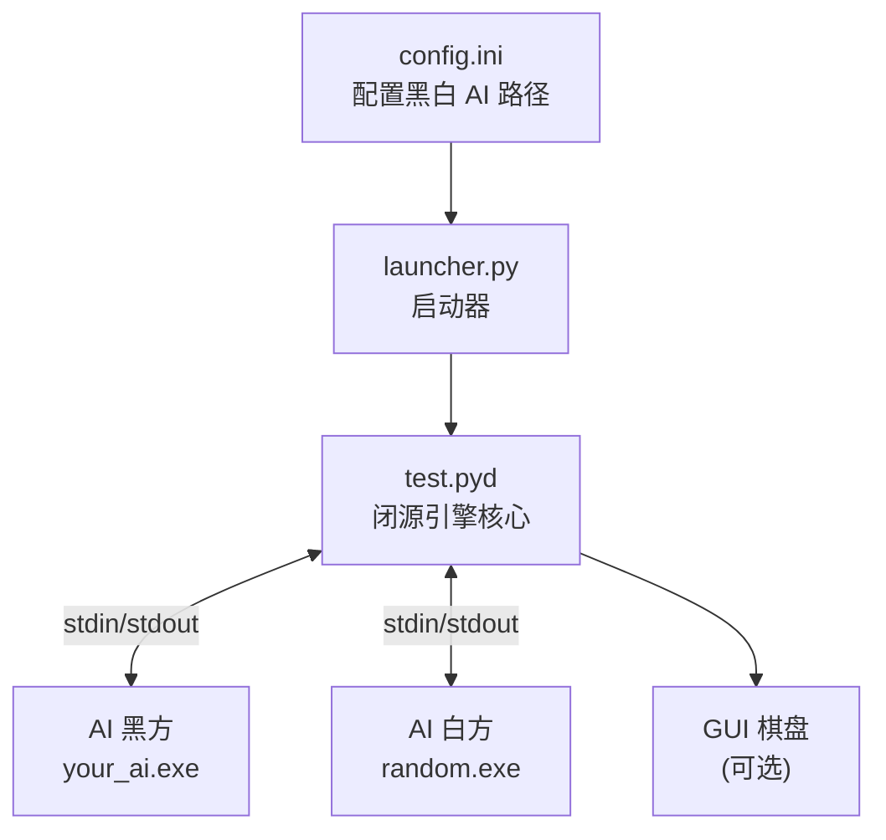
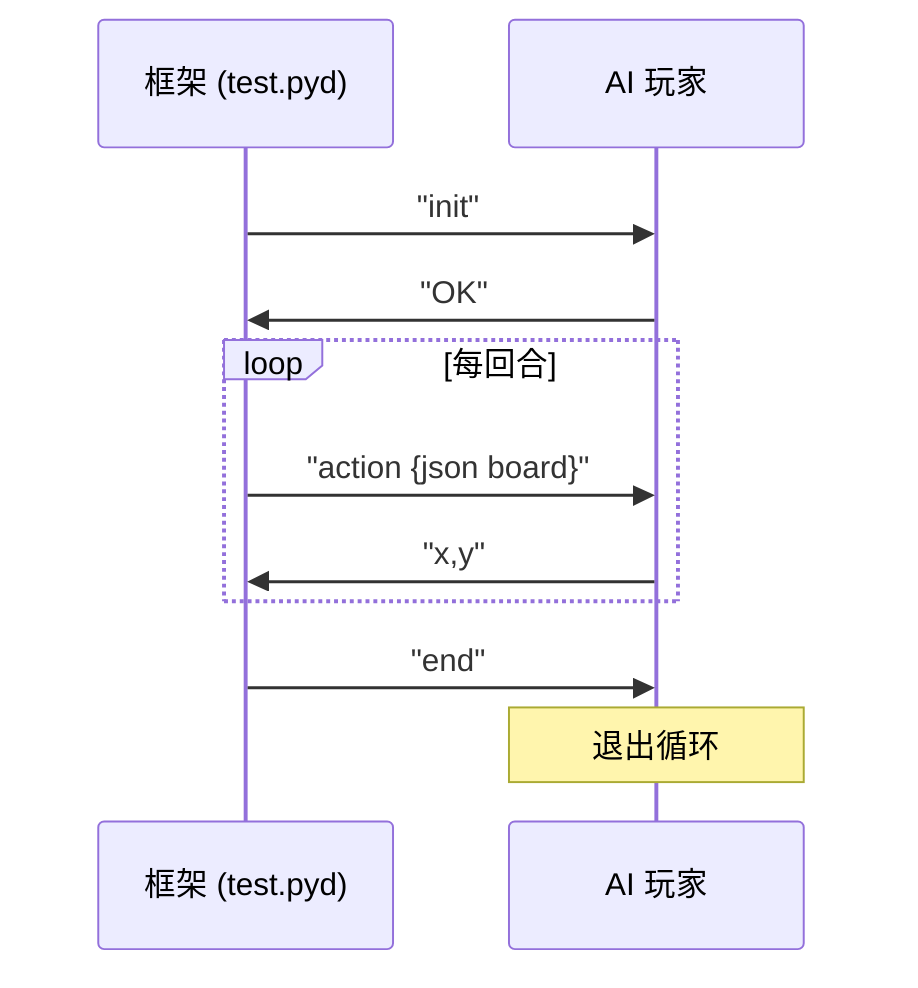
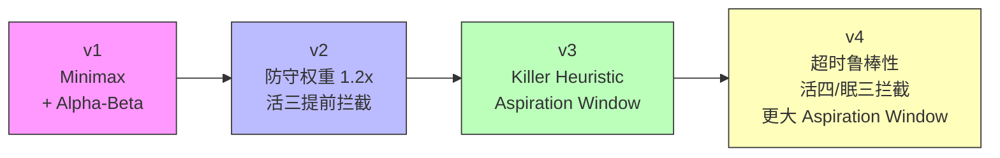

# 🎮 五子棋 AI 对弈框架

> 基于 stdin/stdout 通信协议的五子棋 AI 对弈测试平台，支持自定义 AI 玩家对战。

## 架构总览



## 项目结构

```
Gomoku/
├── test.pyd          # 闭源引擎核心：棋盘管理、规则判定、AI 通信、裁判
├── launcher.py        # 启动器，调用 test.run_from_config()
├── config.ini         # 配置黑白 AI 路径、棋盘大小、超时、局数
│
├── random1.py         # 老师给的随机示例 AI（参考用）
├── random2.py         # 另一个随机示例 AI（参考用）
├── random1.exe        # 预编译好的 random1
├── random2.exe        # 预编译好的 random2
│
├── ai_player.py       # 学生编写的 AI（Minimax + Alpha-Beta + 迭代加深）
├── ai_player.bat      # 包装器，避免命名冲突
│
├── .idea/             # PyCharm 项目配置
└── config.ini         # AI 路径及对局参数
```

## 通信协议

框架与 AI 之间通过 **stdin/stdout** 通信，流程如下：



**board 格式**：二维数组 `board[y][x]`，`0`=空，`1`=黑，`2`=白。

示例：
```json
[
  [0, 0, 0, 0, 0, ...],
  [0, 0, 1, 0, 0, ...],
  [0, 0, 0, 2, 0, ...],
  ...
]
```

## AI 算法演进

`ai_player.py` 基于 Minimax 算法，经历了四个版本迭代：



| 版本 | 核心改进 |
|:---:|---|
| v1 | 基础 Minimax + Alpha-Beta 剪枝 + 迭代加深搜索 |
| v2 | 防守估值权重提升至 1.2x，新增活三提前拦截逻辑 |
| v3 | 引入 Killer Heuristic 启发式 + Aspiration Window 窗口搜索 |
| v4 | 超时鲁棒性修复、活四强制拦截层、眠三拦截、更大的 aspiration window |

## 快速开始

### 1. 配置 AI 路径

编辑 `config.ini`，将自己的 AI 的 exe 路径填入：

```ini
[config]
black = ./random1.exe
white = ./random1.exe
size = 15
timeout = 10
round = 10
alternate_players = True
mode = single
```

### 2. 启动对局

```bash
python launcher.py
```

### 3. 打包为 EXE

```bash
pyinstaller --onefile ai_player.py
```

---

## 开发自己的 AI

### Step 1 — 创建骨架

以 `random1.py` 为基础创建自己的 AI 文件：

```python
import sys

while True:
    cmd = input()
    if cmd == 'init':
        print("OK")
    elif cmd.startswith('action'):
        board = eval(cmd.removeprefix('action '))
        # 👇 在这里写你的落子决策逻辑
        x, y = your_decision(board)
        print(f"{x},{y}")
    elif cmd == 'end':
        break
```

### Step 2 — 实现决策逻辑

只修改 `action` 分支里的落子决策，保留通信骨架不变。

### Step 3 — 打包测试

```bash
pyinstaller --onefile your_ai.py
```

将生成的 exe 路径写入 `config.ini`，运行 `launcher.py` 测试。

---

## 已知陷阱 ⚠️

| 陷阱 | 说明 |
|---|---|
| **命名冲突** | 不要把 AI 文件命名为 `random.py`，会覆盖 stdlib `random` 模块 |
| **BOM 问题** | `config.ini` 不能用 PowerShell `Set-Content -Encoding UTF8`，会加 BOM |
| **胜负显示** | `alternate_players = True` 时黑白互换，10 局全赢也显示 5:5 |
| **GUI 缺失** | `mode = multiple` 可能不显示 GUI，调试用 `mode = single` |

---

## License

MIT — 仅供学习交流使用。
