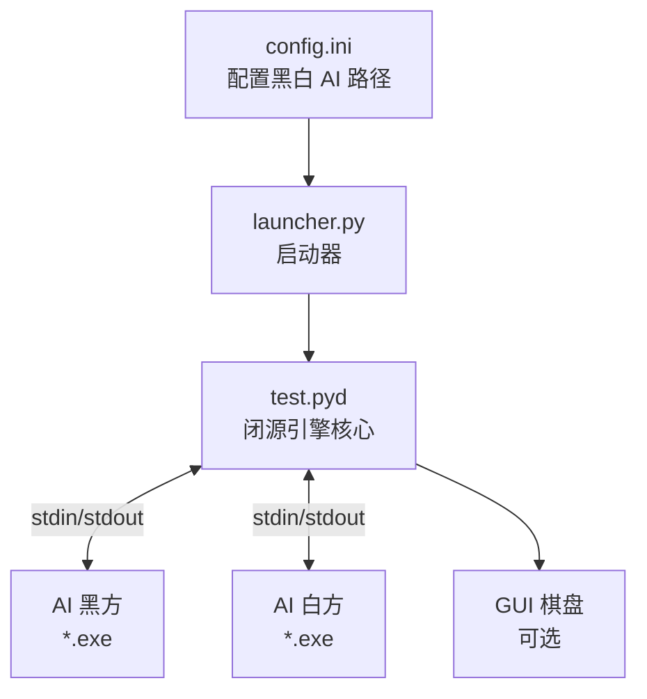
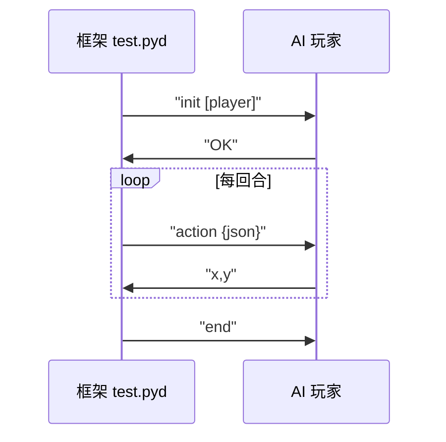

# 五子棋 AI 对弈框架

> 基于 stdin/stdout 通信协议的五子棋 AI 对弈测试平台，支持自定义 AI 玩家对战。

## 架构总览



## 项目结构

```text
Gomoku/
├── test.pyd            # 闭源引擎核心：棋盘管理、规则判定、AI 通信、裁判
├── launcher.py          # 启动器，调用 test.run_from_config("config.ini")
├── config.ini           # 配置黑白 AI 路径、棋盘大小、超时、局数
├── random1.py/.exe      # 老师给的随机示例 AI
├── random2.py/.exe      # 另一个随机示例 AI
├── Test_strong_ai.py    # 强攻版 AI 源码
├── Test_strong_ai.exe   # Test_strong_ai.py 打包结果
├── Test_hybrid_ai.py    # 混合版 AI 源码
└── Test_hybrid_ai.exe   # Test_hybrid_ai.py 打包结果
```

## 当前 AI 版本

| 版本 | 源码 | EXE | 特点 |
|---|---|---|---|
| Strong | `Test_strong_ai.py` | `Test_strong_ai.exe` | 威胁优先、活四/双杀提前识别、轻量 Alpha-Beta |
| Hybrid | `Test_hybrid_ai.py` | `Test_hybrid_ai.exe` | 黑棋沿用强攻核心，白棋增强防守与安全候选过滤 |

推荐优先测试 `Test_hybrid_ai.exe`；如果只想看强攻风格，可以测试 `Test_strong_ai.exe`。

## 通信协议

框架与 AI 之间通过 stdin/stdout 通信：



`board` 是二维数组 `board[y][x]`，`0` 为空，`1` 为黑棋，`2` 为白棋。行动 JSON 通常包含：

```json
{
  "board": [[0, 0, 0], [0, 1, 0], [0, 0, 2]],
  "size": 15,
  "current_player": 1,
  "last_move": [7, 7]
}
```

AI 必须返回从 0 开始的坐标，例如：

```text
7,8
```

## 快速开始

### 1. 配置 AI 路径

编辑 `config.ini`，将自己的 AI exe 路径填入。例如测试混合版：

```ini
[AI_Players]
black_ai = F:\Gomoku\Test_hybrid_ai.exe
white_ai = F:\Gomoku\Test_hybrid_ai.exe

[Game_Settings]
board_size = 15
timeout = 10
delay = 1.0
use_gui = True
mode = single
num_games = 10
alternate_players = False
```

### 2. 启动对局

```bash
python launcher.py
```

### 3. 打包 EXE

```bash
pyinstaller --onefile --name Test_hybrid_ai Test_hybrid_ai.py
```

或打包强攻版：

```bash
pyinstaller --onefile --name Test_strong_ai Test_strong_ai.py
```

## 已知陷阱

| 陷阱 | 说明 |
|---|---|
| 命名冲突 | 不要把 AI 文件命名为 `random.py`，会覆盖 stdlib `random` 模块 |
| BOM 问题 | `config.ini` 不要用 PowerShell `Set-Content -Encoding UTF8` 写入，可能加 BOM |
| 胜负显示 | `alternate_players = True` 时黑白互换，多局结果可能不直观 |
| GUI 缺失 | `mode = multiple` 可能不显示 GUI，调试界面用 `mode = single` |

## 提交流程

1. 修改或新增 AI 源码。
2. 运行协议测试，确认 `init` 返回 `OK`、`action` 返回合法 `x,y`。
3. 使用 PyInstaller 打包 exe。
4. 修改 `config.ini` 指向对应 exe。
5. 运行 `launcher.py` 测试。

## License

MIT - 仅供学习交流使用。